# System Architecture & Design Specification: web-model-bridge

## 1. System Overview & Architecture

**web-model-bridge** is a high-performance local inference bridge that converts free web-based AI interfaces into standardized, low-latency, and anti-blocking **OpenAI (`/v1/chat/completions`)** and **Anthropic (`/v1/messages`)** API endpoints.

By automating a genuine, user-authenticated browser engine via Chrome DevTools Protocol (CDP) or persistent Playwright contexts, the bridge completely eliminates API key costs while inheriting genuine browser security fingerprints—bypassing Cloudflare, BotGuard, and WAF restrictions that break reverse-engineered API proxies.

### High-Level System Architecture

```mermaid
graph TD
    subgraph Clients["Clients & AI Developer Tools"]
        C1[Claude Code CLI]
        C2[Cursor / Windsurf]
        C3[OpenClaw / LibreChat]
        C4[Custom Scripts / SDKs]
        C5[Built-in Chat Playground]
    end

    subgraph Bridge["web-model-bridge (Local Daemon)"]
        subgraph HTTP["HTTP / Server Layer (Hono)"]
            R_OAI["OpenAI Router<br/>/v1/chat/completions"]
            R_ANT["Anthropic Router<br/>/v1/messages"]
            R_MDL["Model Discovery<br/>/v1/models"]
            R_MGT["Management API<br/>/webmodel/*"]
            UI["Dashboard & Chat UI<br/>/, /chat"]
        end

        subgraph Core["Core Orchestration"]
            ROUTER["Inference Router<br/>(Retry / Backoff / Typing Pacing)"]
            REGISTRY["Provider Registry<br/>(Model Resolution & Aliasing)"]
            AUTH["Auth Store<br/>(Local Session State)"]
            FILE["File Handler<br/>(Base64 & Multimodal Pipeline)"]
        end

        subgraph Browser["Browser Driver Layer"]
            BM["Browser Manager<br/>(CDP Attach & Persistent Contexts)"]
            POOL["Page Pool & Domain Locking<br/>(Concurrent Tab Isolation)"]
            DRIVER["Browser UI Driver<br/>(DOM Automation, Extraction & Error Detection)"]
        end
    end

    subgraph Targets["Web AI Platforms (9 Providers)"]
        P1[Claude AI]
        P2[ChatGPT]
        P3[DeepSeek]
        P4[Google Gemini]
        P5[xAI Grok]
        P6[Perplexity]
        P7[Moonshot Kimi]
        P8[Qwen AI]
        P9[Zhipu GLM]
    end

    Clients -->|HTTP / SSE| HTTP
    HTTP --> Core
    Core --> Browser
    BM --> POOL
    POOL --> DRIVER
    DRIVER -->|CDP / Playwright Automation| Targets
```



---

## 2. Core Architectural Principles & Subsystems

### 2.1 Browser Engine & Context Isolation
* **Dual Execution Modes**:
  * **Attach Mode (Default, Recommended)**: Connects to an existing user Google Chrome instance running with `--remote-debugging-port=9222`. Zero overhead, instant startup, and automatic reuse of existing logged-in sessions. If Chrome is not running, the bridge auto-launches a dedicated Chrome instance.
  * **Launch Mode**: Launches an isolated Playwright persistent browser context in a dedicated local directory for headless or server-grade deployments.
* **Auto-Discovery of Active Sessions**:
  * On startup, the `BrowserManager` scans Chrome cookies and open tabs to detect pre-authenticated providers (e.g. Gemini, ChatGPT, Claude) without requiring manual login button clicks.
* **Page Pooling & Concurrency Locking**:
  * Pages are managed in an origin-partitioned pool (`Map<string, Page[]>`).
  * Incoming concurrent requests to the same or different providers acquire an idle page or spawn a new tab on-demand, preventing cross-request prompt contamination while maintaining high throughput.
  * A central `idleShutdown` timer recycles unused pages after 5 minutes of inactivity to keep RAM usage minimal (~300–500 MB).

### 2.2 Intelligent Extraction & Anti-Blocking Driver (`BrowserUIDriver`)
* **Thinking & Reasoning Suppression**:
  * Advanced models (such as Qwen 2.5/QwQ, DeepSeek V3/R1, GLM-4, and Kimi K2.5) generate internal thought traces (`<think>`, `.qwen-chat-thinking-tool-status-card-wraper`, etc.).
  * The driver monitors generation phase transitions, strictly suppressing thinking blocks and streaming exclusively clean, finalized assistant answer prose.
* **In-Page Error Intelligence (`detectPageError`)**:
  * Real-time DOM inspection detects upstream toast banners, modal alerts, usage quotas, capacity limits, session timeouts, and rate limits across both English and Chinese error strings.
  * Instead of hanging or timing out over 90 seconds, queries that hit limits immediately terminate with structured error events and client error scenes.
* **Typing Delay & Human Pacing Fallback**:
  * Certain modern web text inputs (Lexical, ProseMirror, Slate) intercept instant clipboard pasting.
  * The router features an automated retry pipeline: if an initial prompt is not acknowledged, it automatically falls back to an incremental keyboard typing pacing (12ms delay) ensuring 100% input reliability.
* **Multimodal File & Attachment Pipeline**:
  * Validates and prepares images, code files, and documents directly onto local disk.
  * Directly drives provider file input elements (`input[type="file"]`), verifying file attachment chips prior to dispatching prompts.

---

## 3. API & Protocol Specifications

### 3.1 Universal API Endpoints

| Endpoint | Method | Protocol | Format | Description |
|---|---|---|---|---|
| `/v1/chat/completions` | POST | HTTP / SSE | OpenAI ChatML | Universal chat endpoint supporting streaming and non-streaming |
| `/v1/messages` | POST | HTTP / SSE | Anthropic Messages | Anthropic-compatible chat endpoint (Claude Code, Claude Desktop) |
| `/v1/models` | GET | JSON | OpenAI Model List | Enumerates available models or top-level provider catalog |
| `/` | GET | HTML | Web UI | Control Panel & Configuration Dashboard |
| `/chat` | GET | HTML | Web UI | Built-in Interactive Web Chat Playground |
| `/webmodel/providers` | GET | JSON | Internal | Returns real-time authentication and model status |
| `/webmodel/auth/login` | POST | JSON | Internal | Initiates background browser tab login for a provider |
| `/webmodel/auth/logout` | POST | JSON | Internal | Clears local session record for a provider |
| `/webmodel/health` | GET | JSON | Internal | Service uptime, memory metrics, and browser connectivity |

### 3.2 Model Aliasing & Discovery
Clients can request models using either canonical identifiers or convenient short aliases:
* `gemini` → `gemini-web/gemini-3-flash`
* `chatgpt` → `chatgpt-web/gpt-5.4-mini`
* `claude` → `claude-web/claude-sonnet-4-6`
* `deepseek` → `deepseek-web/deepseek-v4`
* `qwen` → `qwen-web/qwen-3.5-plus`
* `grok` → `grok-web/grok-3`
* `kimi` → `kimi-web/kimi-k2.5`
* `glm` → `glm-web/glm-5`
* `perplexity` → `perplexity-web/sonar-pro`

---

## 4. Visual Design System (Dashboard & Playground)

### 4.1 Atmosphere & Aesthetic
The web-model-bridge interface is an infrastructure control panel — quiet, focused, and technically precise.
* **Deep Charcoal Canvas (`#09090b`)**: Minimizes eye fatigue during extended development sessions.
* **Elevated Surfaces (`#111113`)**: Content lives on slightly elevated surfaces separated by hairline borders using the shadow-as-border technique.
* **Single Accent (Indigo `#6366f1`)**: Reserved strictly for interactive elements, status indicators, and active states.
* **Semantic Signals**: Green (`#22c55e`) for authenticated/healthy states, Red (`#ef4444`) for errors/unauthenticated states, Yellow (`#eab308`) for warnings.

### 4.2 Color Palette Tokens

```css
/* Surfaces */
--bg-canvas:        #09090b;
--bg-surface:       #111113;
--bg-surface-hover: #1a1a1f;
--bg-recessed:      #09090b;

/* Accents */
--accent-indigo:       #6366f1;
--accent-indigo-hover: #818cf8;
--accent-indigo-muted: rgba(99, 102, 241, 0.12);

/* Semantics */
--color-success:       #22c55e;
--color-success-muted: rgba(34, 197, 94, 0.15);
--color-error:         #ef4444;
--color-error-muted:   rgba(239, 68, 68, 0.12);
--color-warning:       #eab308;

/* Typography */
--text-primary:   #e4e4e7;
--text-secondary: #a1a1aa;
--text-muted:     #52525b;

/* Borders & Shadows */
--border-color:       #1f1f23;
--border-shadow:      0 0 0 1px #1f1f23;
--card-shadow:        0 0 0 1px #1f1f23, 0 2px 4px rgba(0, 0, 0, 0.2);
--elevated-shadow:    0 0 0 1px #1f1f23, 0 4px 12px rgba(0, 0, 0, 0.3);
```

### 4.3 Typography Hierarchy

| Role | Size | Weight | Line Height | Letter Spacing | Font Family |
|---|---|---|---|---|---|
| **Page Title** | 18px | 600 | 1.3 | -0.02em | System Sans |
| **Section Heading**| 13px | 600 | 1.3 | 0.05em | System Sans (Uppercase) |
| **Body** | 14px | 400 | 1.5 | normal | System Sans |
| **Code / URL / Tokens**| 13px | 400 | 1.5 | normal | SF Mono / Consolas |
| **Badges / Status**| 11px | 500 | 1.3 | 0.03em | System Sans |

### 4.4 API Code Implementation Showcase Component
The Dashboard and Chat Studio feature an interactive, developer-centric code showcase:
* **Interactive Tool / Language Tabs**:
  * `cURL (OpenAI)`: Standard streaming `/v1/chat/completions` request.
  * `cURL (Anthropic)`: Standard streaming `/v1/messages` request with `x-api-key`.
  * `Python (OpenAI SDK)`: Complete, runnable script streaming chunks from `client.chat.completions.create`.
  * `Node.js (OpenAI SDK)`: Native async-iterable stream consumer using `OpenAI` client.
  * `Claude Code CLI`: Ready-to-paste shell exports for `ANTHROPIC_BASE_URL` and `ANTHROPIC_API_KEY`.
  * `Cursor / Windsurf`: Custom model endpoint configuration JSON.
  * `OpenClaw / LibreChat`: Provider configuration block for direct integration.
* **Dynamic Model Binding**:
  * Selecting any of the 9 supported models automatically updates the snippet's model identifier, prompt context, and canonical fallback.
* **One-Click Clipboard Copying**:
  * Copy button copies the exact snippet and triggers immediate visual feedback ("✓ Copied!") and toast confirmation.
* **Dual UI Surface**:
  * **Dashboard**: Full-width card with multi-language tabs and model dropdown.
  * **Chat Studio**: Topbar `⚡ API Snippets` action opening an in-page modal synchronized to the active playground model.

---

## 5. Security & Isolation Architecture

1. **Zero Credential Ingestion**:
   - The bridge never prompts for, reads, or stores plaintext user passwords.
   - Authentication is performed entirely by the user in the genuine web interface. The bridge only monitors the presence of session cookies or authenticated UI roots.
2. **Localhost Binding & Access Control**:
   - By default, the bridge binds strictly to `127.0.0.1`.
   - An optional Bearer token (`--auth-token <secret>`) protects all API endpoints when binding to public network interfaces.
3. **Data Privacy**:
   - Conversations, files, and tokens reside solely within the local Chrome browser session and the user's local machine.
   - No external telemetry, tracking, or cloud proxy servers are utilized.
